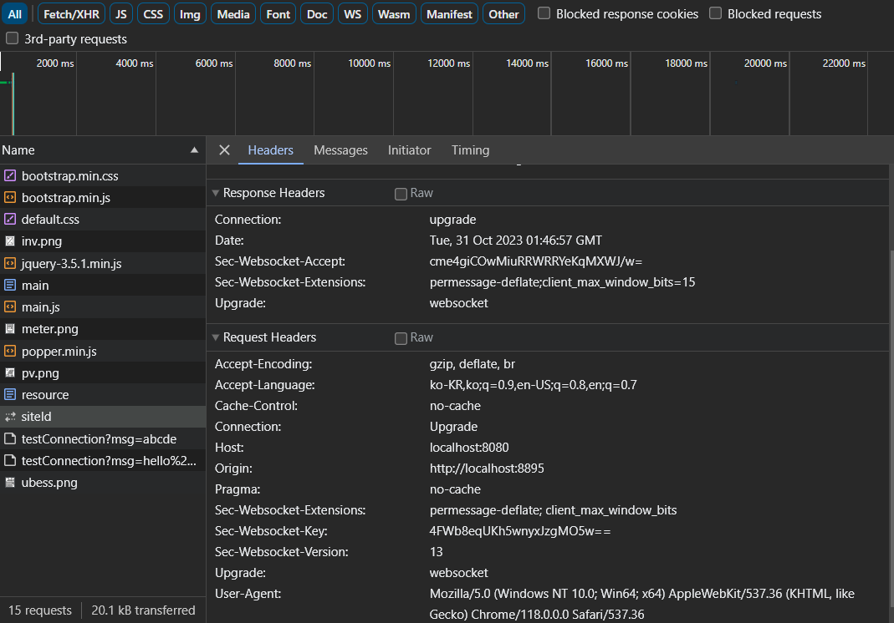
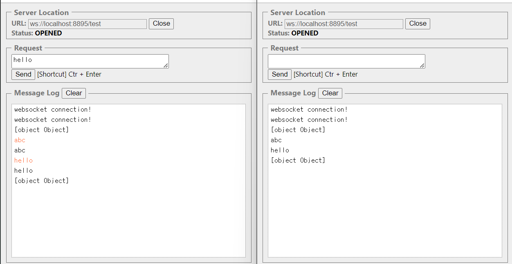
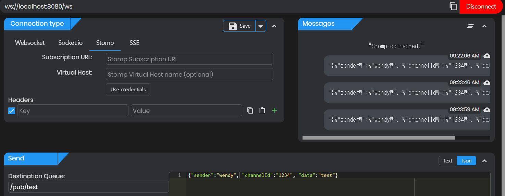
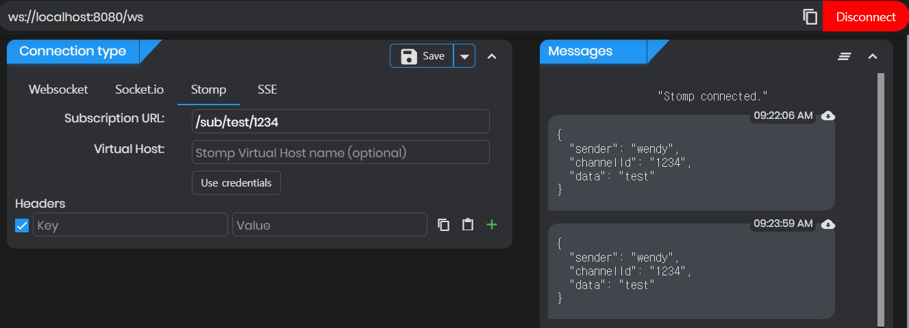
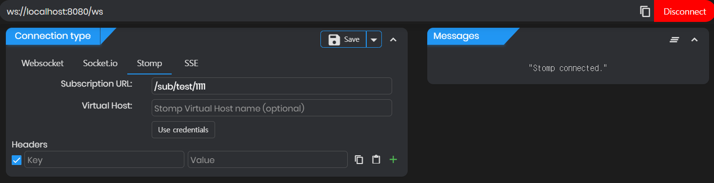

# WebSocketTest
- SpringBoot에서 Websocket 사용하는 방법을 공부중입니다!
- [`WebSocketConfigurer`와 `WebSockethandler`를 구현해서 사용](#websocket)
- [`STOMP` 사용](#stomp)
- [서버와 서버 간 웹소켓 연결 시 `@ServerEndpoint` 와 `@ClientEndpoint` 사용](#server-to-server)

# WebSocketTest v2
- [서버와 서버 간 웹소켓 연결 시 `Endpoint` 상속받아 구현](#websockettest-v2-1)

# WebSocketTest v3
- [서버와 서버 간 웹소켓 연결 시 `springframework.web.socket.*` 사용](#websockettest-v3-1)

## WebSocket
- 웹소켓 서버 구현
```java
//method override하여 핸들러 구현 
public class WebSocketHandler extends TextWebSocketHandler {

    //웹소켓이 연결될 때 생기는 연결정보를 담고 있는 객체
    //핸들러에서 웹소켓 통신을 처리하기 위해 컬렉션에 담아서 처리
    private final Map<String, WebSocketSession> map = new HashMap<>();

    @Override
    public void afterConnectionEstablished(WebSocketSession session) throws Exception {}

    @Override
    protected void handleTextMessage(WebSocketSession session, TextMessage message) throws Exception {}

    @Override
    public void afterConnectionClosed(WebSocketSession session, CloseStatus status) throws Exception {}
}

//config에 등록하고 사용
public class WebSocketConfig implements WebSocketConfigurer {
    @Override
    public void registerWebSocketHandlers(WebSocketHandlerRegistry registry) {
        registry.addHandler(webSocketHandler, "/test") //웹소켓 연결 주소
                .setAllowedOrigins("*"); //스프링 기본 정책 : same origin만 허용
    }
}
```
- 클라이언트 측 구현
```javascript
webSocket = new WebSocket("ws://localhost:8080/test");
webSocket.onopen = onOpen; //웹소켓 연결 발생
webSocket.onclose = onClose; //웹소켓 연결 종료
webSocket.onmessage = onMessage; //웹소켓으로 연결 된 서버로부터 메시지 수신
webSocket.onerror = onError; //웹소켓 오류 처리

function onOpen() {}

function onClose() {}

//서버로부터 메시지 수신
function onMessage(message) {}

function onError(error) {
    webSocket.close(); //웹소켓 연결 닫음
}

//서버에 메시지 전송
function sendMessage(message) {
   webSocket.send(message);
}
```
- Test site
  - 크롬 확장프로그램 `Simple WebSocket Client` 사용

  - Origin : localhost:8895
  - Host : localhost:8080
  - Connection : upgrade


## STOMP
- pub에서 메시지를 발행하면
- sub에서 channel ID가 같은 경우 메시지 수신
- 웹소켓 서버 구현
```java
public class WebSocketConfig implements WebSocketMessageBrokerConfigurer {
    @Override
    public void configureMessageBroker(MessageBrokerRegistry registry) {
        // 메세지 구독 요청 url -> 메세지 받을 때
        registry.enableSimpleBroker("/sub");
        // 메세지 발행 요청 url -> 메세지 보낼 때
        registry.setApplicationDestinationPrefixes("/pub");
    }

    @Override
    public void registerStompEndpoints(StompEndpointRegistry registry) {
        registry.addEndpoint("/ws") // stomp 설정
                .setAllowedOrigins("*");
    }
}
```  
- Test site
  - https://apic.app/online/#/tester
  - pub에서 메시지 발신

  - channel ID가 같을 경우 메시지 수신

  - channel ID가 다를 경우 메시지 수신 안 함



## server to server
- `@ServerEndpoint` 구현
```java
@ServerEndpoint(value = "/test", configurator = ServerEndpointConfigurator.class)
	public class WebSocketEndpoint {
		@OnOpen
	  public void onOpen(Session session){}
	
	  @OnMessage
	  public void onMessage(String message, Session session) throws IOException {
	      //클라이언트로 메시지 보내기
	      session.getBasicRemote().sendText("서버에서 받은 메시지: " + message);
	  }
	
	  @OnClose
	  public void onClose(Session session) {}
	
	  @OnError
	  public void onError(Throwable throwable) {}
}

@Configuration
public class ServerEndpointConfigurator extends ServerEndpointConfig.Configurator implements ApplicationContextAware {

    private static volatile BeanFactory context;
    @Override
    public <T> T getEndpointInstance(Class<T> clazz) throws InstantiationException {
        return context.getBean(clazz);
    }

    @Override
    public void setApplicationContext(ApplicationContext applicationContext) throws BeansException {
        ServerEndpointConfigurator.context = applicationContext;
    }
}

//빈 등록 후 사용하기
@Bean
public ServerEndpointExporter serverEndpointExporter() {
	return new ServerEndpointExporter();
}
```
- `@ClientEndpoint` 구현
```java
@ClientEndpoint
public class WebSocketClient {

	//웹소켓 연결 위한 메서드
	public void connectWebSocketClient() {
	try{
	    WebSocketContainer container = ContainerProvider.getWebSocketContainer();
	    container.connectToServer(this, new URI("ws://localhost:8080/test"));
	} catch (Exception e) {
	    e.printStackTrace();
	}
    

	@OnOpen
	public void onOpen(Session session){
	this.session = session;
	}
	
	//서버로부터 메시지 받기
	@OnMessage
	public void onMessage(String message) {}
	
	@OnClose
	public void onClose() throws IOException {
	this.session.close();
	}
	
	@OnError
	public void onError(Throwable throwable) {}
	
	//서버에 메시지 보내기
	public void sendMessage(String message) throws IOException {
	session.getBasicRemote().sendText(message);
	}
}
```
- 같은 어플리케이션 내에서 웹소켓 세션 중복되지 않도록 싱글톤으로 관리

## WebSocketTest v2
- 서버와 서버 간 웹소켓 연결 시 `Endpoint` 상속받아 구현
- 어노테이션을 사용할 때와는 달리
- `onOpen`, `onClose`, `onError` 구현해주어야 하고
- `onMessage` 대신 `MessageHandler.Whole<String>`를 상속받은 MessageHandler 구현해 주어야 하나
- 웹소켓 서버와 최초 연결 시 헤더정보를 보내는 등의 설정을 위해 사용함
  - `ClientEndpointConfig.Configurator`를 상속받아 서버간 최초의 연결(handshake) 전에 header 정보 등을 설정
 
## WebSocketTest v3
- 스프링부트에서 제공하는 websocket 사용
- websocket 최초 연결 시 http연결과 동일하게 header에 data 추가하여 요청 할 수 있음
- 보통 인증정보 등을 실어 보냄

